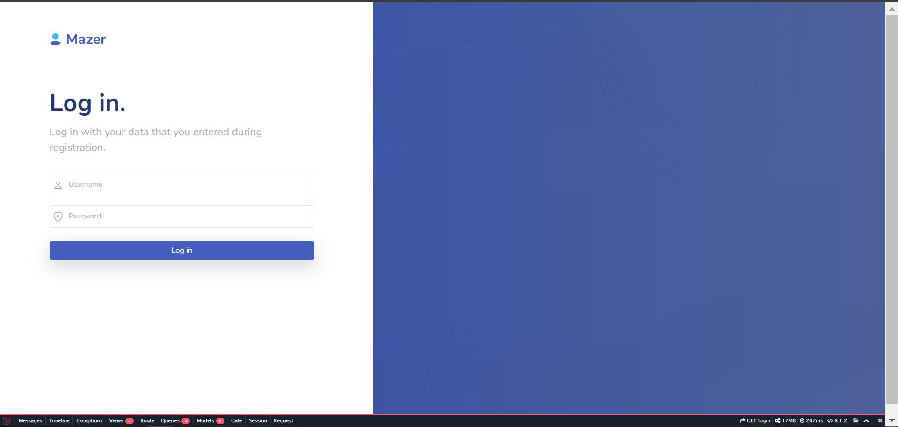
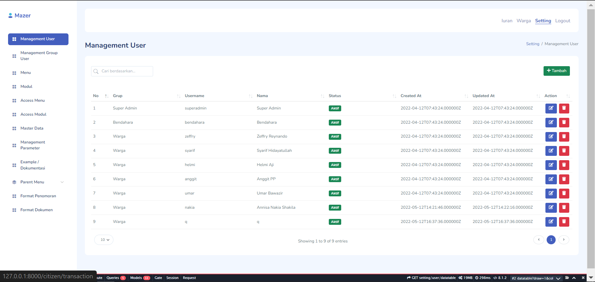
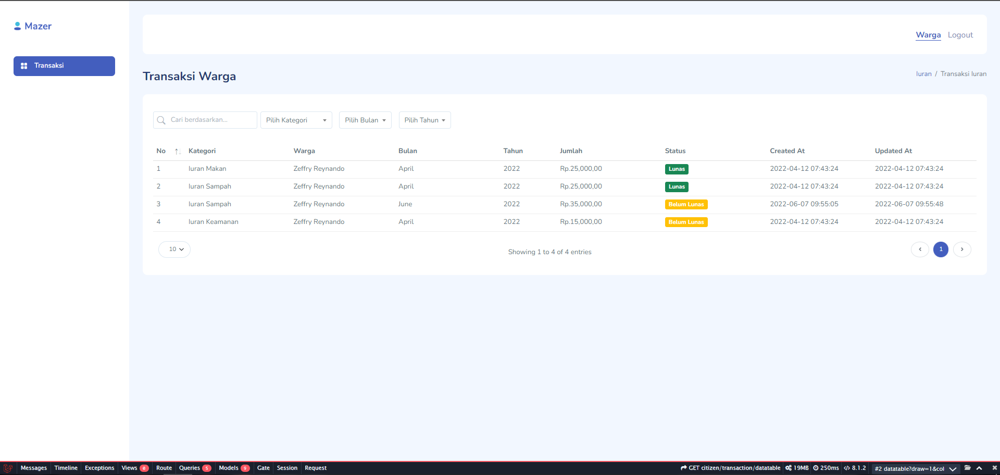

  

# Yuuran Admin Website

Website admin untuk mengatur transaksi iuran warga dan pembuatan REST API untuk mobile application.

## Fitur

#### Basic
- [x] Halaman Login & Logout

#### Modul Setting
- [x] Management User
- [x] Management Group User
- [x] Management Menu
- [x] Management Modul
- [x] Management Akses Menu
- [x] Management Akses Modul
- [x] Management Master Data
- [x] Management Parameter

#### Modul Iuran
- [x] Management Kategori Iuran (Keamanan, Kebersihan, dll)
- [x] Management Transaksi Iuran semua warga

#### Modul Warga
- [x] Melihat Transaksi berdasarkan warga yang login

## Preview Website

<table>
    <tbody>
        <tr>
            <td>
                <h3 style="text-align :center ;">Login</h3>
                
            </td>
        </tr>
        <tr>
            <td>
                <h3 style="text-align :center ;">Modul Setting</h3>
                
            </td>
        </tr>
        <tr>
            <td>
                <h3 style="text-align :center ;">Modul Iuran</h3>
                
            </td>
        </tr>
        <tr>
            <td>
                <h3 style="text-align :center ;">Modul Warga</h3>
                
            </td>
        </tr>
    </tbody>
</table>

## Issues

Please file any issues, bugs or feature request as an issue on <a href="https://github.com/zgramming/Yuuran-Admin/issues"><b> Github </b></a>

## Contributing

Pull requests are welcome. For major changes, please open an issue first to discuss what you would like to change.

<table border="0" cellspacing="0" cellpadding="0">
    <thead>
        <tr>
            <th>Github</th>
            <th>LinkedIn</th>
            <th>Facebook</th>
            <th>Instagram</th>
            <th>Website</th>
        </tr>
    </thead>
    <tbody>
        <tr>
            <td>
            
            </td>
            <td></td>
            <td></td>
            <td></td>
            <td></td>
        </tr>
    </tbody>

</table>
